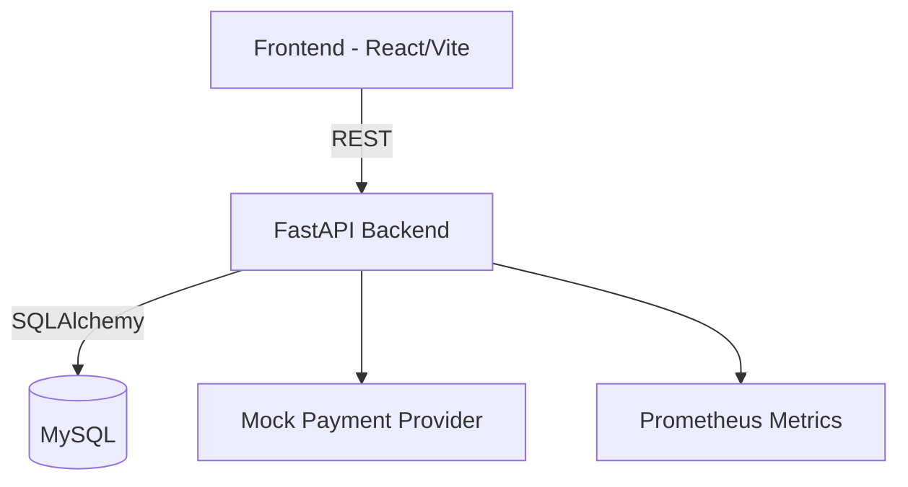

# Mini E-commerce

A production-ready mini e-commerce platform featuring a FastAPI backend, a React + Vite frontend, and a MySQL database. The project emphasizes clean architecture, type safety, and containerized workflows for local development.

## Architecture



## Prerequisites

- Python 3.11+
- Node.js 20+
- Docker & Docker Compose (for containerized setup)

## Quick Start

```bash
make install-backend
make install-frontend
make backend-dev  # starts FastAPI on http://localhost:8000
make frontend-dev # starts Vite on http://localhost:5173
```

To seed demo data:

```bash
make seed
```

## Docker Compose

```bash
cd deploy
docker compose up --build
```

Backend is available at `http://localhost:8000`, frontend at `http://localhost:5173`, and Swagger docs at `http://localhost:8000/docs`.

## Testing & Quality

```bash
make test       # pytest with coverage
make lint       # ruff linting
make typecheck  # mypy static analysis
```

## Environment Variables

Backend configuration values are stored in `deploy/env/.env.example`. Copy the file to `.env` for local development and adjust as needed.

Frontend variables live in `deploy/env/.env.frontend.example`.

## Seed Accounts

- Admin: `admin@example.com` / `AdminPass123`
- Customer: `demo@example.com` / `DemoPass123`

Use these credentials after running `make seed` to explore the application.
